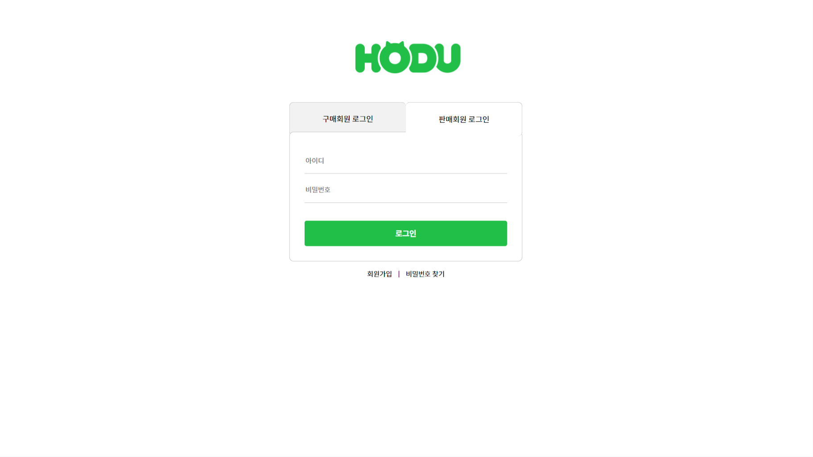

# 📝Project03 : Open_market_service

[](https://git.io/typing-svg)

#### 오픈 마켓 서비스

> 판매자와 구매자를 구별하여 판매자는 상품 등록, 판매를 가능하게 하고 구매자는 구매를 가능하게 하는 서비스이다.

## 사용 기술

   </br>

## 기능

💡 서버 API를 이용하여 기능 구현

- 비회원, 로그인(구매자), 로그인(판매자)에 맞는 UI확인 가능
- 비회원은 구매자 또는 판매자로 회원가입 가능
- 회원은 구매자 또는 판매자로 로그인 가능

<!-- 다이어그램 추가 시 수정 -->

## 배포 URL

- https://jini0012.github.io/Open_market_service/

  > 테스트용 계정 (구매자)

  ```
  id : test00
  pw : test1234
  ```

  > 테스트용 계정 (판매자)

  ```
  id : test01
  pw : test12345
  ```

  |   기능   | HTTP Method | 비회원 권한 | 회원 권한 |
  | :------: | :---------: | :---------: | :-------: |
  | 회원가입 |    POST     |     ✅      |           |
  |  로그인  |    POST     |             |    ✅     |
  | 로그아웃 |             |             |    ✅     |
  | 상품목록 |     GET     |     ✅      |    ✅     |
  | 상품상세 |     GET     |     ✅      |    ✅     |

<!-- JS 수정 시 함께 수정 -->

## 프로젝트

> 프로젝트 구조

- MPA 사용

  |  🖥️  |   로그인   |  회원가입   | 상품 목록  | 상품 상세  | 서버 에러  |
  | :--: | :--------: | :---------: | :--------: | :--------: | :--------: |
  | Page | login.html | signup.html | index.html | goods.html | error.html |

  <!-- 
  📦 Open_market_service
  ┣ 📂assets
  ┣ 📂css
  ┃ ┣ 📜common.css
  ┃ ┣ 📜error.css
  ┃ ┣ 📜goods.css
  ┃ ┣ 📜login.css
  ┃ ┣ 📜main.css
  ┃ ┣ 📜reset.css
  ┃ ┗ 📜signup.css
  ┣ 📂js
  ┃ ┣ 📜common.js
  ┃ ┣ 📜goods.js
  ┃ ┣ 📜login.js
  ┃ ┣ 📜main.js
  ┃ ┗ 📜signup.js
  ┣ 📜error.html
  ┣ 📜goods.html
  ┣ 📜index.html
  ┣ 📜login.html
  ┣ 📜README.md
  ┗ 📜signup.html


- 개발 일정

````
  mermaid
gantt
    title A Gantt Diagram
    dateFormat  YYYY-MM-DD
    section HTML / CSS 작성
    로그인  : a1, 2024-10-14, 1d
    회원가입  : b1, 2024-10-14, 1d
    상품목록 : after a1, 2d
    상품상세 : after b1, 2d
    404 error : c1, 2024-10-14, 1d


``` -->

## 요구사항 & 기능 명세

> 구매자 페이지

✅ : 진행 완료 / ❓: 진행중 / 빈칸: 미진행

- 로그인 페이지

  -> 10/14 HTML, CSS 작성

  -> 10/15~10/17 JS 적용
  | 📝확인사항 | 로그인 페이지 | 내용 |CHECK|
  | :-: | :-: | :- | :-: |
  | 1 | 아이디, 비밀번호 미일치 | 로그인 경고 문구, 비밀번호 입력창에<br> focus 이벤트 + 빈칸 |✅|
  | 2 | 로그인 경고창 나타날경우 | 로그인 버튼 눌러도 로그인 불가 |✅|
  | 3 | input에 미입력시 | 입력되지 않은 입력창에 focus 이벤트 |✅|
  | 4 | 로그인 성공 | 로그인하기 이전 페이지로 이동 |✅|

- 회원가입 페이지

  -> 10/14 HTML, CSS 작성

  -> 10/15~10/17 JS 적용
  | 📝확인사항 | 회원가입 페이지 | 내용 |CHECK|
  | :-: | :-: | :- | :-: |
  | 1 | 모든 입력 완료 + 동의하기 체크 시 | 회원가입 가능 |✅|
  | 2 | 회원정보 입력 후 회원가입 버튼 클릭 | 로그인 페이지로 이동 |✅|
  | 3 | 아이디 중복 버튼 클릭 | 아이디 중복시 경고 문구 |✅|
  | 4 | 구매 회원가입 탭 누르고 가입시 | 구매자로 회원가입 |✅|
  | 5 | 순서대로 입력하지 않는 경우 | 필수 정보입니다 경고 문구|✅|

- 상품 목록 페이지

  -> 10/15 HTML, CSS 일부 작성

  -> 10/16 CSS 작성

  -> 10/17 JS 적용

  | 📝확인사항 |   상품 목록 페이지    | 내용                               | CHECK |
  | :--------: | :-------------------: | :--------------------------------- | :---: |
  |     1      | 목록에서 상품 클릭 시 | 상품 상세 페이지로 이동            |  ✅   |
  |     2      |       상품 목록       | 상품 판매자, 상품명, 가격이 보여짐 |  ✅   |

- 상품 상세 페이지

  -> 10/16 HTML, CSS 작성
  -> 10/17 JS 적용

  | 📝확인사항 |     상품 상세 페이지     | 내용                                                   | CHECK |
  | :--------: | :----------------------: | :----------------------------------------------------- | :---: |
  |     1      |     페이지 열렸을 때     | productId에 해당하는 상품을 불러오고, 상품 정보 보여줌 |  ✅   |
  |     2      | +버튼 - 버튼 클릭 시에만 | 상품 수량 변경 가능                                    |  ✅   |
  |     3      |       수량 변경 시       | 상품 재고 수량 초과하면 +버튼 비활성화                 |  ✅   |
  |     4      |        선택 옵션         | 선택된 옵션에 맞춰서 가격을 계산 및 총 가격 나타냄     |  ✅   |

* 404 페이지 -> 10/16 작성 완료

> 추가 기능

- 페이지 상단 글로벌 네비게이션(GNB)
  | 📝확인사항 | GNB | 내용 |CHECK|
  | :-: | :-: | :- | :-: |
  | 1 | 상단 검색창 | UI로만 존재 |✅|
  | 2 | 구매회원 및 비로그인 회원 | 검색창과 장바구니 버튼만 존재 |✅ <br>로그인 버튼 존재하도록 구현|
  | 3 | 로그인 유저 | 장바구니 버튼은 UI로만 존재 |✅|
  | 4 | 판매회원의 페이지 상위버튼 | 마이페이지 버튼과 판매자 센터 버튼이 UI로만 존재 |✅|

- 로그인 요청 모달
  | 📝확인사항 | 로그인 요청 모달 | 내용 |CHECK|
  | :-: | :-: | :- | :-: |
  | 1 | 비로그인 사용자 | 장바구니, 바로구매 클릭 시 모달 창 open |✅|

- 마이페이지
  | 📝확인사항 | 마이페이지 | 내용 |CHECK|
  | :-: | :-: | :- | :-: |
  | 1 | GNB에서 마이페이지 클릭 | 마이페이지, 로그아웃 모달창 open |✅|
  | 2 | 드롭박스 내 마이페이지 | UI로만 존재 |✅|
  | 3 | 드롭박스 내 로그아웃 클릭 | 로그아웃 기능 실행 |✅|

> 판매자 (도전)

- 로그인 페이지
- 회원가입 페이지
- 상품 목록 페이지
- 상품 상세 페이지

## 화면 구현

### 1. 회원가입 및 로그인페이지

|       ⭐       |                      구매회원                       |                      판매회원                       |
| :------------: | :-------------------------------------------------: | :-------------------------------------------------: |
| signup<br>기본 |       |       |
| signup<br>입력 |  |  |
|     login      |         |         |

### 2. 상품 목록 , 상세 페이지 및 모달

|          ⭐          |                            비회원                             |                        구매회원                        |                    판매회원                    |
| :------------------: | :-----------------------------------------------------------: | :----------------------------------------------------: | :--------------------------------------------: |
|         GNB          |                            |                   |           |
|    마이<br>페이지    |                              ❌                               |  |                구매회원과 동일                 |
|  index<br>상품목록   |                   |          |  |
|  goods<br>상품상세   |                  |          |  |
|  goods<br>수량버튼   |             |                           ❌                           |                       ❌                       |
| goods<br>로그인 모달 |       |                           ❌                           |                       ❌                       |
| goods<br>로그인모달  |  |                           ❌                           |                       ❌                       |

## 에러 및 해결

-
-
-

## 개발하며 느낀점

-
-
-
````
